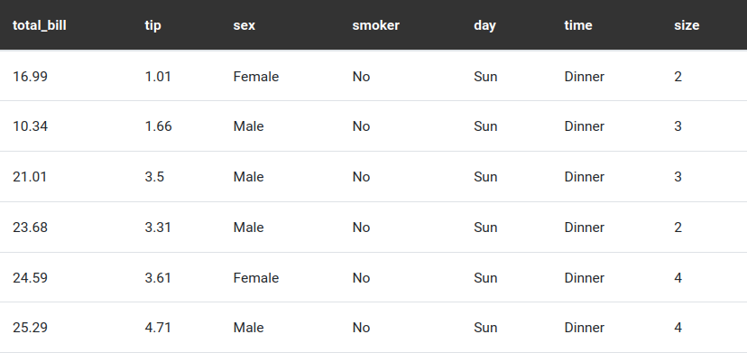
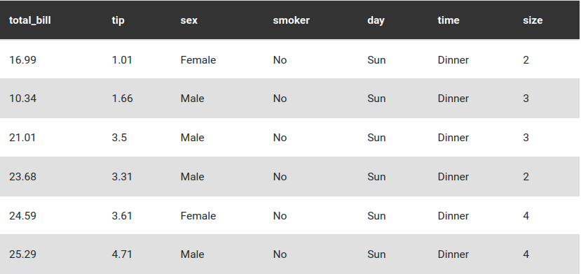

# Custom shortcodes for [Wowchemy Website Builder](https://wowchemy.com/docs)

This is a collection of custom shortcodes for [Wowchemy Website Builder](https://wowchemy.com/docs) for [Hugo](https://gohugo.io/). 

I hope to add more shortcodes in the future, since I just started to experiment with Hugo.

## Widgets

1. [**Better Table**](shortcodes/better-table/)  
   Improved version of the base `table` widget, allowing for a deeper configuration of the table.

|                       Default                        |                       Striped                        |
| :--------------------------------------------------: | :--------------------------------------------------: |
|  |  |

|                      Small                       |                      Hover                       |
| :----------------------------------------------: | :----------------------------------------------: |
|  |  |

2. [*Gallery with Caption*](shortcodes/gallery-with-caption/)  
Custom version of the `gallery` shortcode to display the caption even outside the fancybox and to fix some other issues I found with the base one. Additional parameters are also available.

