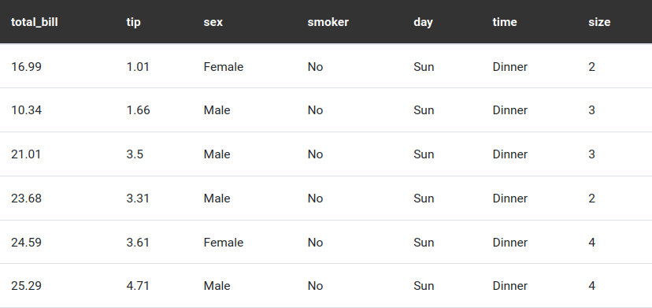
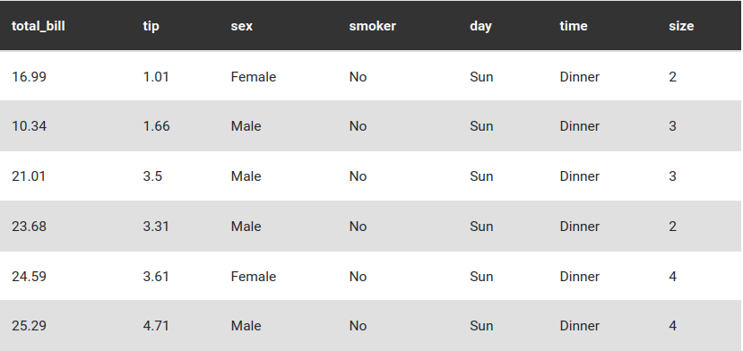
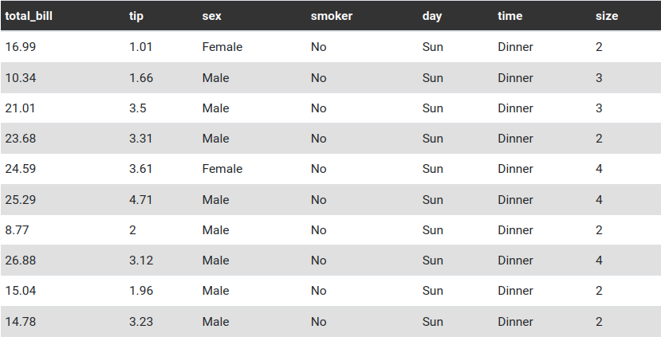
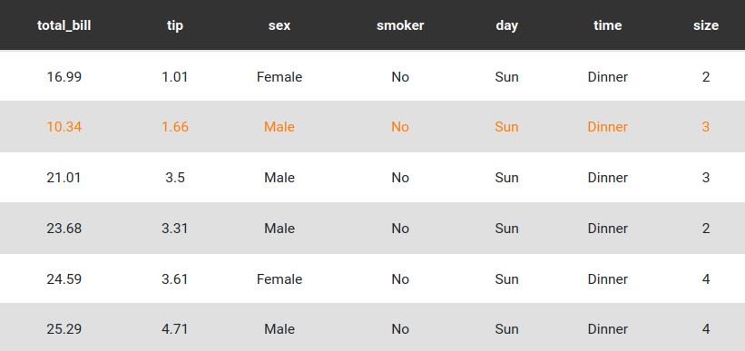

# Better Table

Improved version of the `table` shortcode, to allow a deeper configuration and an easier way to target specific class with custom css. The new parameters assign additional bootstrap classes besides the default `table`. 
See [Bootstrap Tables documentation](https://getbootstrap.com/docs/4.6/content/tables/) for more information about the classes.

In order to be non-breaking with the base `table` shortcut, the default values of the parameters lead to the same output of the base shortcut.


---

**Table of Contents**

- [Parameters](#parameters)
- [Changes](#changes)
- [How to use the shortcode](#how-to-use-the-shortcode)
    - [Add the shortcode to your site](#add-the-shortcode-to-your-site)
    - [Use the shortcode in page content](#use-the-shortcode-in-page-content)
    - [Customize the appearance with CSS](#customize-the-appearance-with-css)
- [Screenshots](#screenshots)

---

## Parameters

- **`src` :**  
    Path or url to the csv table. Path is relative to the folder where the shortcode is called.

- **`delimiter` : *default ","***  
    Cell delimiter.

- **`header` : default "true"**  
    If "true", first row is interpreted as the header.

- **`caption` : *optional***  
    Caption for the table.

- **`striped` : *default "false"***  
    If "true", add the class `table-striped`, to make alternate rows of different colors.

- **`hover` : *default "fals"e***  
    If "true", add the class `table-hover`, to enable a hover state on the current row.  
    *[**NOTE**: when styling with css, "color" attribute work, while "background-color" does not]*

- **`responsive` : *default "false"***  
    If "true", it defaults to "md".
    If a str must be one of ["sm", "md", "lg", "xl"], otherwise it defaults to "md".
    If not false, add the class `table-responsive-$responsive`,
    to make the table horizontable scrollable under the specified breakpoint.

- **`small` : *default false***  
    If "true", add the class `table-sm`, to make the table more compact by cutting cell padding in half.

- **`halign` : *default "left"***  
    Horizontal text alignment for the table.
    If passed, must be one of ["left", "center", "right"], otherwise it defaults to "left".

## Changes

- Header row is encapsulated inside `<thead>` tag
- Additional class can be set using the parameters:
    `"table-striped"`, `"table-hover"`, `"table-responsive-XX"`, `"table-sm"`.
    See: https://getbootstrap.com/docs/4.6/content/tables/
- Parameter for horizontal text alignment

## How to use the shortcode

### Add the shortcode to your site

Install your shortcode in your site by referencing it at the bottom of your `config/_default/config.yaml`:

```yaml
module:
  imports:
    # your existing imports
    - path: github.com/Agos95/wowchemy-shortcode-collection/shortcodes/better-table
```

### Use the shortcode in page content

To use the shortcode in your page content just add:

```

```

### Customize the appearance with CSS

Each class added to the table can be individually extended with custom styles, in order to have full control on the appearance of the table. Just put your custom code in `assets/scss/custom.scss`.

Here, there is an example:

```scss
.table {
    // customize header row of each table
    // with white text on dark background
    thead {
        color: #ffffff;
        background-color: #333333;
    }
}

// customize the alternate row colors for `table-striped` tables
.table-striped tbody {
    tr {
        // odd rows with white background
        &:nth-child(odd) td {
            background-color: #ffffff;
        }
        // even rows with light gray background
        &:nth-child(even) td {
            background-color: #e0e0e0;
        }
    }
}
// color the text of the hovered row
.table-hover tbody {
    tr:hover {
        color: #ff0000;
    }
}
```

## Screenshots

Some screenshot as example (with some custom css as the one shown in the previous section):

| `` | `` |
| -------------------------------------------------------------------------------------------------------------------------- | ------------------------------------------------------------------------------------------------------------------------- |
|                                                                  |                                                                 |

| `` | `` |
| ------------------------------------------------------------------------------------------------------------------------ | ------------------------------------------------------------------------------------------------------------------------------ |
|                                                                    |                                                                          |