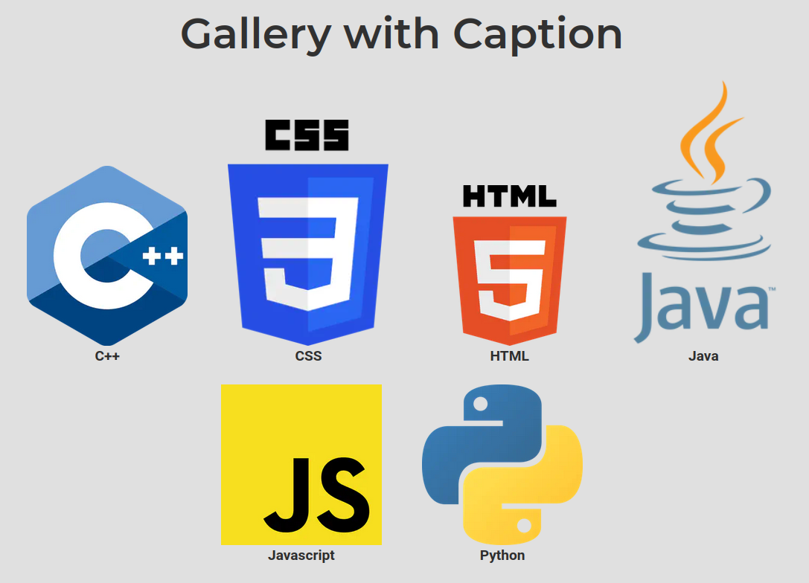

# Gallery with Caption

Custom version of the `gallery` shortcode, in order to fix some issues I encountered with the base shortcode.  
In particular, this shortcode displays the caption even outside the fancybox. In addition, all the gallery items are center-aligned, so if you have a row with less images than the others, those pictures are centered (instead of being on the left).

For Wowchemy versions from v5.6, the required Fancybox css and javascript is loaded only on the pages where the shortcode is called by using the Hook system.

---

**Table of Contents**

- [Changes](#changes)
- [Parameters](#parameters)
- [How to use the shortcode](#how-to-use-the-shortcode)
    - [Add the shortcode to your site](#add-the-shortcode-to-your-site)
    - [Enable Fancybox (only on Wowchemy versions prior to v5.6)](#enable-fancybox-only-on-wowchemy-versions-prior-to-v56)
    - [Use the shortcode in page content](#use-the-shortcode-in-page-content)
    - [Customization](#customization)
- [Screenshots](#screenshots)

---

## Changes

- Add a `<figure>` which contains both the image (with the fancybox link on click) and the caption
- Resize is done with `.Resize` function instead of `.Fit`
- If caption is not set for an image, the invisible `&#8205;` character is used to maintain the alignment


## Parameters

- **`album` : *default "gallery"***  
    Album folder in `assets/media/albums/` to search the images in.

- **`order` : *default "asc"***  
    One of ["asc", "desc"]. Sorting order by image Name.

- **`processing` : *default "resize"***  
    One of ["resize", "fit"], otherwise it defaults to "resize".
    Set the hugo image processign function, respectively [`.Resize`, `.Fit`].
    See: https://gohugo.io/content-management/image-processing/ .

- **`resize_options` : *optional***  
    Resize options passed to Hugo image processing function.
    Defaults to "x500" if processing is "resize",
    or to "500x500" if processing is "fit".

- **`fig_style` : *optional***
    Additional style parameters for each `<figure>` tag.
    For instance, you can specify a padding between pictures.

- **`img_style` : *default "max-height:300px;"***  
    Additional style parameters for each `` tag.
    To have a better results, the advice is to set max-height a bit lower than the resize option.

## How to use the shortcode

### Add the shortcode to your site

Install your shortcode in your site by referencing it at the bottom of your `config/_default/config.yaml`:

```yaml
module:
  imports:
    # your existing imports
    - path: github.com/Agos95/wowchemy-shortcode-collection/shortcodes/gallery-with-caption
```

### Enable Fancybox (only on Wowchemy versions prior to v5.6)

This shortcode makes use of [Wowchemy Hooks](https://wowchemy.com/docs/hugo-tutorials/extending-wowchemy/#hooks) to include Fancybox css and javascript only on the pages where the shortcode is called. Hooks are supported from version v5.6.  
If you are on older versions, you can add `require_fancybox: true` to your `_config/defaults/params.yaml` file. In this way Fancybox is included in all your site pages (even if there is no `gallery` or `gallery-with-caption` shortcode). You should also be able to activate it per page by adding `require_fancybox: true` in the frontmatter (*I did not test this*).

### Use the shortcode in page content

To use the shortcode in your page content just add:

```

```

To add captions for your images, just follow the standard approach (see the [official docs](https://wowchemy.com/docs/content/writing-markdown-latex/#image-gallery)).

### Customization

This custom gallery is inside the tag `<div class="gallery-with-caption">`. So you can use the class `gallery-with-caption` in your `assets/scss/custom.scss` to make further customization without affect the standard gallery.

You can find the default scss file shipped with this shortcode to make the layout work in [assets/scss/gallery-with-caption.scss](./assets/scss/gallery-with-caption.scss).

## Screenshots

```

```

